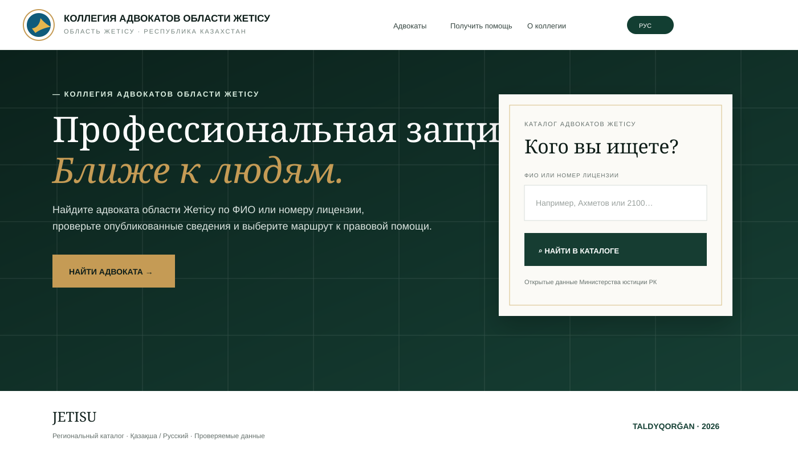
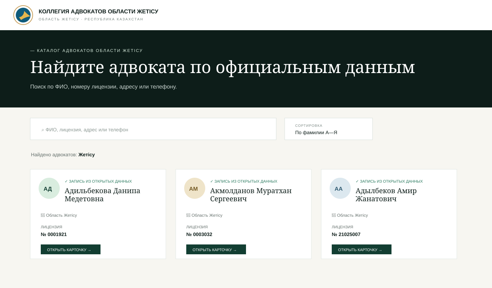
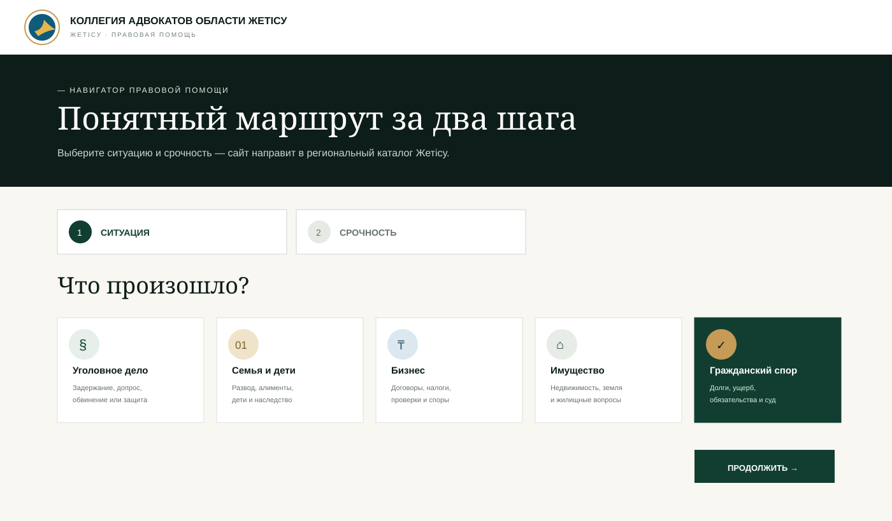
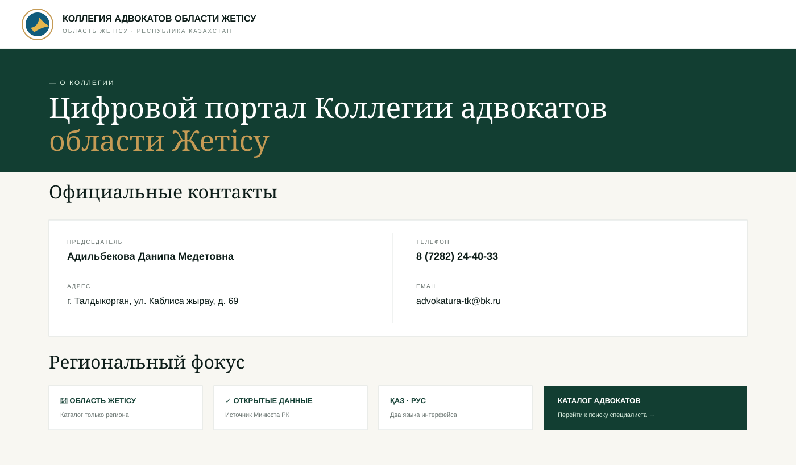

<div align="center">

# ⚖️ Коллегия адвокатов области Жетісу

### Жетісу облыстық адвокаттар алқасы

**Поиск адвокатов · Правовая помощь · Открытые данные · Қазақша / Русский**

[](https://nextjs.org/)
[](https://www.typescriptlang.org/)
[](#региональный-фокус)
[](#возможности)

[**Открыть демонстрационную версию →**](https://collegia-advokatov.zhanibekdauletovich.chatgpt.site/?v=main)

</div>

---

## О проекте

Современный цифровой портал для **Коллегии адвокатов области Жетісу**.

Портал помогает жителям региона быстро найти адвоката по ФИО или номеру лицензии, посмотреть опубликованные сведения, перейти к контактам специалиста и определить маршрут правовой помощи. Интерфейс доступен на русском и казахском языках.

> **Региональный фокус:** пользовательская часть сайта ограничена областью Жетісу. Адвокаты других регионов Казахстана в каталоге не показываются.

---

# 📸 Интерфейс

## Главная страница

Региональная айдентика **JETISU**, быстрый поиск адвоката и понятный маршрут к правовой помощи.



## Каталог адвокатов

Поиск по ФИО, номеру лицензии, адресу и опубликованным контактам. Каталог ограничен **областью Жетісу**.



<table>
<tr>
<td width="50%" valign="top">

### Навигатор помощи

**Ситуация → срочность → готовый маршрут к каталогу Жетісу.**



</td>
<td width="50%" valign="top">

### О коллегии

Официальные контакты, региональная направленность и принципы публикации данных.



</td>
</tr>
</table>

> Превью сохранены прямо в репозитории. Они не зависят от авторизации ChatGPT или внешних screenshot-сервисов.

---

## 🏛️ Официальные контакты коллегии

| | |
|---|---|
| **Официальное наименование** | Коллегия адвокатов области Жетісу |
| **Қазақша** | Жетісу облыстық адвокаттар алқасы |
| **Председатель** | Адильбекова Данипа Медетовна |
| **Адрес** | область Жетісу, г. Талдыкорган, ул. Каблиса жырау, д. 69 |
| **Телефон** | 8 (7282) 24-40-33 |
| **Email** | advokatura-tk@bk.ru |

---

## ✨ Возможности

| Возможность | Реализация |
|---|---|
| **Региональный каталог** | Только адвокаты области Жетісу |
| **Поиск** | ФИО, лицензия, адрес, телефон |
| **Карточка адвоката** | Лицензия, дата выдачи, дата вступления, адрес, контакты |
| **Быстрая связь** | Телефон и WhatsApp при наличии номера в источнике |
| **Навигатор помощи** | Ситуация → срочность → каталог Жетісу |
| **Два языка** | Русский и казахский интерфейс |
| **Адаптивность** | Компьютер, планшет, смартфон |
| **Источник каталога** | Открытые данные Министерства юстиции РК |
| **SEO** | Региональные запросы по Жетісу / Талдыкоргану |

---

## 🗺️ Региональный фокус

Сайт создаётся именно для **Коллегии адвокатов области Жетісу**: убраны формулировки «все адвокаты Казахстана» и выбор 20 регионов; каталог фильтруется по `область Жетісу`; карточки адвокатов других регионов не открываются; SEO ориентировано на Жетісу и Талдыкорган; раздел «Регионы» преобразован в страницу «О коллегии».

---

## 🛡️ Источник и корректность данных

Каталог формируется из открытого набора Министерства юстиции Республики Казахстан — **«Список адвокатов»** на портале открытых данных. Используемая версия источника обновлена владельцем **08.07.2025** и помечена как требующая актуализации, поэтому перед заключением соглашения необходимо дополнительно проверить текущий статус лицензии и членство адвоката в территориальной коллегии.

Сайт не создаёт вымышленные рейтинги, специализации или оценки адвокатов.

---

## 🧱 Технологии

`Next.js` · `TypeScript` · `React` · `CSS` · `Lucide Icons` · `Open Data / JSON` · `Responsive UI`

### Основные разделы

```text
/             — главная
/advokaty     — каталог адвокатов области Жетісу
/advokaty/:id — карточка адвоката
/pomosh       — навигатор правовой помощи
/regions      — о коллегии и официальные контакты
```

---

## 🚀 Локальный запуск

```bash
npm ci
npm run dev
```

Проверка:

```bash
npm run lint
npm run build
```

---

<div align="center">

### Коллегия адвокатов области Жетісу

**Современный цифровой доступ к профессиональной правовой помощи в регионе.**

[Открыть сайт](https://collegia-advokatov.zhanibekdauletovich.chatgpt.site/?v=main) · [Каталог адвокатов](https://collegia-advokatov.zhanibekdauletovich.chatgpt.site/advokaty?v=main) · [Получить помощь](https://collegia-advokatov.zhanibekdauletovich.chatgpt.site/pomosh?v=main)

</div>
