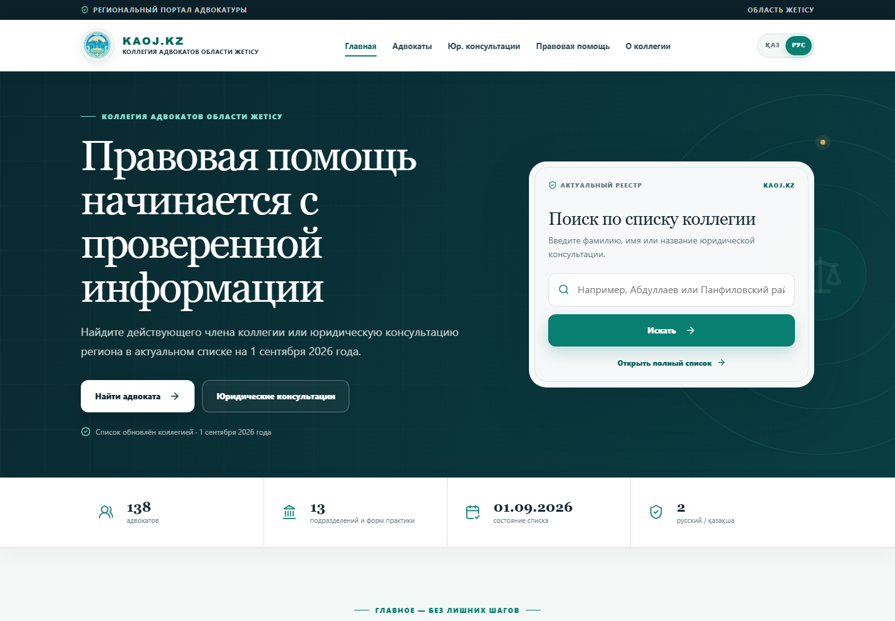
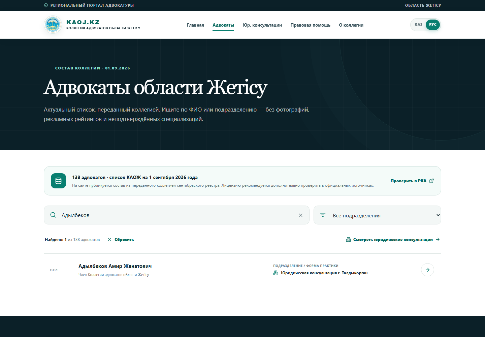
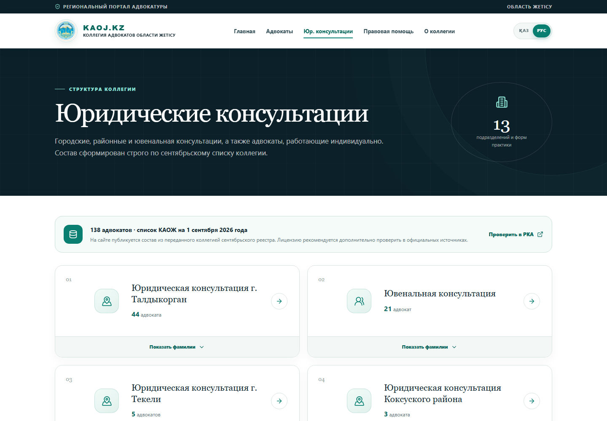
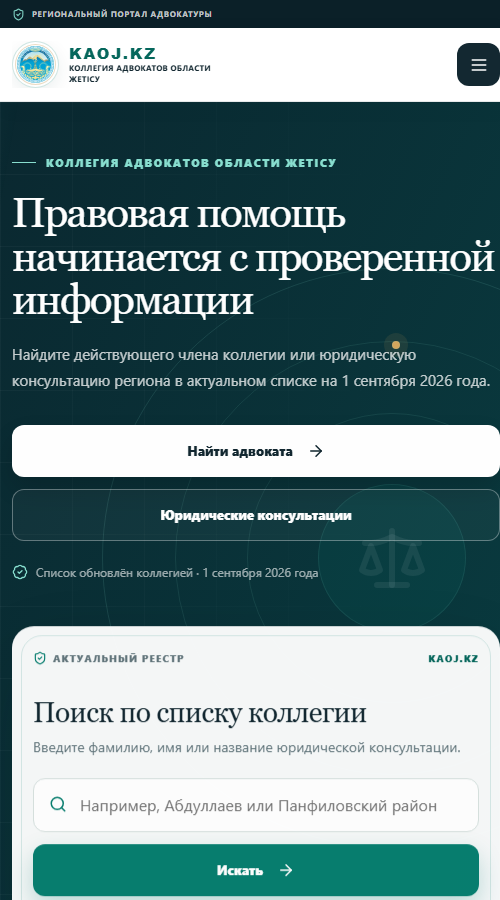

# KAOJ.KZ — Коллегия адвокатов области Жетісу

Двуязычный региональный портал Коллегии адвокатов области Жетісу. Будущий домен проекта — **KAOJ.KZ**.

Сайт показывает актуальный состав коллегии на 1 сентября 2026 года, юридические консультации и официальные контакты. В каталоге нет фотографий, рекламных рейтингов и специализаций, которых нет в переданном реестре.



## Что реализовано

- каталог из 138 адвокатов с поиском, фильтром и пагинацией;
- 13 юридических консультаций и форм практики с раскрываемым составом;
- отдельные записи адвокатов без фотографий и неподтверждённых данных;
- русский и казахский интерфейс с сохранением выбранного языка;
- официальные сведения из подписанного договора;
- адаптивная вёрстка, доступные состояния фокуса и сдержанная анимация;
- метаданные для поисковых систем и будущего домена KAOJ.KZ.

| Сведение | Значение |
|---|---|
| Председатель президиума | Мулазакирова Альфия Абдыкадыровна |
| Юридический адрес | г. Талдыкорган, ул. Майстрюка, дом 2А |
| БИН | 220640028571 |
| Телефон приёмной | 8 (7282) 24-40-33 |
| Email | advokatura-tk@bk.ru |

Отдельный номер для обращений пока не публикуется — на сайте для него оставлено информационное место.

## Разделы

- `/` — главная страница и поиск;
- `/advokaty` — актуальный список адвокатов;
- `/advokaty/[slug]` — запись адвоката;
- `/konsultacii` — юридические консультации и их состав;
- `/pomosh` — памятка перед обращением;
- `/regions` — сведения о коллегии и реквизиты.

## Актуализация списка

Исходный административный Excel-файл не хранится в публичном репозитории. В сайт попадает только сформированный JSON с ФИО, регионом и подразделением.

```bash
python scripts/import-advocates-xlsx.py "/path/to/общий список за сентябрь 26.xlsx"
```

Результат записывается в `public/data/advocates-september-2026.json`. Импорт проверяет дату реестра, заполненность строк и дубли ФИО.

## Разработка и проверка

```bash
npm ci
npm run dev
npm run lint
npm test
```

`npm test` выполняет production-сборку Vinext, проверяет артефакт Sites и запускает тест готового HTML.

## Логотип и домен

Текущая эмблема используется как временный логотип. Единая заменяемая точка размечена атрибутом `data-logo-slot="replace-with-approved-logo"` в `app/components/portal-shell.tsx`.

До подключения KAOJ.KZ канонический адрес задаётся переменной `NEXT_PUBLIC_SITE_URL`; по умолчанию используется текущий адрес публикации Sites.

## Скриншоты

| Каталог | Юридические консультации |
|---|---|
|  |  |


